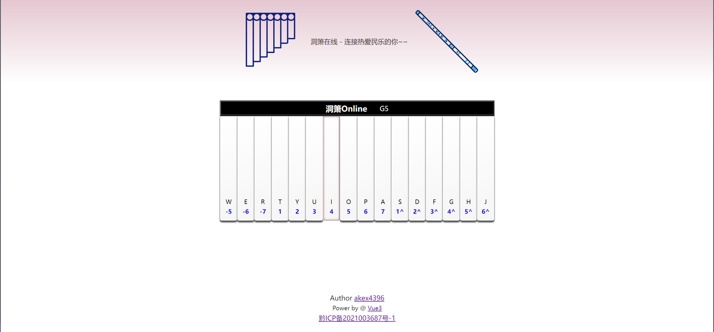

**[dx.akexc.com](https://dx.akexc.com)**

中国民族乐器-[洞箫](https://baike.baidu.com/item/%E6%B4%9E%E7%AE%AB/512219)

在线演奏网站,欢迎加入民乐大家庭~~

 

<samp>code is licensed under <a href='./LICENSE'>MIT</a>,  words and images are licensed under <a href='https://creativecommons.org/licenses/by-nc-sa/4.0/'>CC BY-NC-SA 4.0</a></samp>.

---

### why do it?

自己喜欢洞箫/笛子,也是一个前端爱好者.网络上好像没有在线洞箫演奏的 website, 多领域融合未尝不是一次最佳实践

---

### Todo

[√] 样式

[√] 鼠标演奏

[√] 公告

[√] 键盘演奏

[×] 录制洞箫音源

[×] 移动端

[×] 自动演奏

[×] CI / CD

---

### 效果预览

---

### 鸣谢

Face open source!! I just a coding Beginner but Standing On The Shoulder Of Giants.

[Vue](https://cn.vuejs.org/) - 渐进式 [MVVM]() 框架

[Vite](https://vitejs.cn/) - 下一代前端工具链

[Unocss](https://uno.antfu.me/) - [antfu](https://antfu.me/) 大佬的 [原子化 css](https://css-tricks.com/lets-define-exactly-atomic-css/)成果

[AutoPiano](https://www.autopiano.cn/) - web piano 最佳实践

[shuimo-ui](https://github.com/janghood/shuimo-ui) - 国风 UI 组件库

- 受该开源项目启发, 逐渐 get `洞箫在线` 的 idea

[...]()
